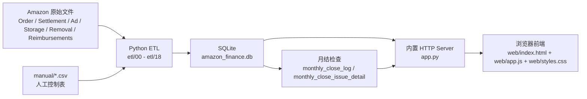
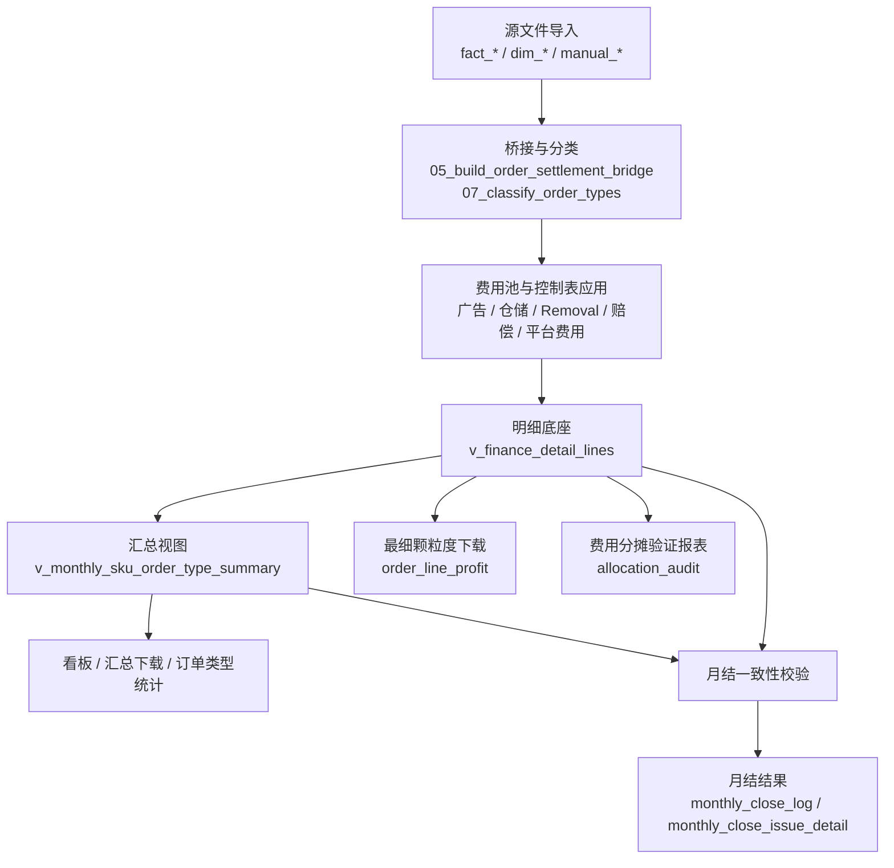

# Amazon财务系统技术设计与重构优化方案

## 快速导航

1. [文档目的与适用范围](#1-文档目的与适用范围)
2. [系统建设过程回顾](#2-系统建设过程回顾)
3. [当前系统总架构](#3-当前系统总架构)
4. [当前数据链路与单一数据底座](#4-当前数据链路与单一数据底座)
5. [当前核心财务口径](#5-当前核心财务口径)
6. [当前月结机制](#6-当前月结机制)
7. [当前系统问题与技术债](#7-当前系统问题与技术债)
8. [重构目标与设计原则](#8-重构目标与设计原则)
9. [重构方案](#9-重构方案)
10. [优化实施顺序与验收标准](#10-优化实施顺序与验收标准)
11. [附录](#11-附录)
12. [结论](#12-结论)

## 1. 文档目的与适用范围

本文档面向研发交接，目标不是重复项目规划稿，而是基于当前工作区真实代码、真实数据库行为和已落地前后端能力，沉淀一份可继续维护、可继续重构、可继续验收的技术文档。

本文档完成三件事：

1. 总结本期系统从项目书到可运行浏览器系统的建设过程与关键转折。
2. 固化当前已经实现并实际运行的技术架构、数据底座、财务口径、月结规则与页面能力。
3. 在不修改现有代码的前提下，给出后续重构与优化方案，作为下一阶段工程治理基线。

本文档以当前代码为唯一准绳，重点依据以下实现：

- `app.py`
- `etl/16_build_monthly_finance_views.py`
- `etl/17_run_month_close_checks.py`
- `web/app.js`
- `Amazon财务系统_当前系统建设与复现手册.md`

本文档不替代现有复现手册。现有手册保留为“当前运行与复现说明”，本文档作为“技术总文档和重构方案”独立存在。

---

## 2. 系统建设过程回顾

### 2.1 项目书落地阶段

**目标**

- 先把 Amazon 平台财务数据沉淀为可复跑数据库。
- 建立 `SQLite + Python ETL` 的单机实现，避免一开始就进入复杂部署。
- 将原始源文件、人工控制表、月结校验放到同一个工程目录内。

**当时新增能力**

- 建立 `amazon_finance.db`。
- 建立 `etl/00_init_db.py` 到 `etl/18_export_manual_worklists.py` 的 ETL 骨架。
- 建立主维表、事实表、人工控制表、月结日志表。
- 支持原始文件导入、桥接、订单类型分类、月结问题导出。

**暴露的问题**

- 虽然 ETL 链路完整，但最初更偏“数据库搭建”，还没有浏览器入口。
- 财务规则最初写在设计稿和脚本中，尚未通过前台联调暴露细节问题。
- 业务同学难以直接在浏览器里验证单月结果。

**为什么进入下一轮修正**

- 需要一个浏览器可见的驾驶舱，降低沟通成本，缩短“发现问题 -> 修口径 -> 再验证”的周期。

### 2.2 首版浏览器驾驶舱阶段

**目标**

- 建立可直接浏览器访问的单机财务驾驶舱。
- 把月度 KPI、趋势、订单追踪、SKU 经营等能力放进同一页面。

**当时新增能力**

- `app.py` 提供内置 HTTP Server。
- `web/index.html`、`web/app.js`、`web/styles.css` 形成前端页面。
- 初版页面支持：
  - 总览
  - SKU 经营
  - 订单追踪
  - 数据导出

**暴露的问题**

- 初版更像看板，对“月跑、手工控制、问题闭环”支持不够。
- 页面能看，但不能完成必要的财务动作。
- 下载与前台查看仍然偏展示导向，不够月结化。

**为什么进入下一轮修正**

- 财务系统不能只看不能管，必须把源文件上传、月跑触发、人工确认、问题工作清单也纳入系统。

### 2.3 操作中心与人工控制阶段

**目标**

- 把“系统能跑”和“系统能管”打通。
- 把人工控制表从后台文件概念变成可视化操作链路的一部分。

**当时新增能力**

- 新增 `操作中心` 页签。
- 支持：
  - 源文件上传
  - 触发 `etl/99_run_monthly.py`
  - 查看月跑状态和日志
  - 浏览手工控制文件和工作清单
  - 前台填写 `Removal` 确认项

**暴露的问题**

- 前台操作一旦涉及 ETL 重建，后端导入路径和脚本耦合问题会暴露出来。
- “保存前台确认项”和“重建后刷新页面”链路的可靠性要求显著提高。
- 财务系统中的人工确认不只是界面问题，而是直接影响月结和下载权限。

**为什么进入下一轮修正**

- 需要把“页面填写 -> 控制表落地 -> 重建汇总 -> 刷新月结状态”变成可靠闭环。

### 2.4 最细颗粒度与订单查询阶段

**目标**

- 建立财务级最细颗粒度下载。
- 支持按订单号查询、按 SKU 或订单类型汇总、按月导出、按订单导出。

**当时新增能力**

- 新增统一下载模块。
- 支持：
  - 月度累计统计预览和下载
  - 单订单最细明细预览和下载
  - 按口径导出最细颗粒度数据
  - 费用分摊验证报表

**暴露的问题**

- 最细颗粒度底座最初曾掺杂订单表逻辑，导致与结算事实不完全一致。
- 部分字段名不够财务化，例如早期的 `review_*`、`inbound_cost` 命名。
- 下载能力一旦开放，就必须强依赖月结阻断，否则会导出错误数据。

**为什么进入下一轮修正**

- 财务系统里“最细颗粒度”必须先统一定义，再谈汇总、看板和下载。
- 最终收敛到：最细颗粒度底座统一由结算事实驱动，并通过 `v_finance_detail_lines` 暴露。

### 2.5 财务口径纠偏阶段

**目标**

- 把“能跑”改成“财务上能对”。
- 针对退款、赔偿、仓储费、广告费、Removal、头程成本等关键口径逐项纠偏。

**当时新增能力**

- 引入利润表口径和应收款口径的双口径体系。
- 引入费用报告与结算报告的核对逻辑。
- 引入 `non_order_fee` 明细行承接无法挂到订单销售行的费用。
- 引入 `alloc_share` 验证报表，而不是把分摊比例混在主下载里。

**暴露的问题**

- 结算报告、费用报告、人工控制表三者之间的边界必须说清楚，否则同一字段会被多处解释。
- 退款成本、Removal 分类、仓储费承接方式等问题一旦处理不清，会直接影响利润和应收款。
- 真实联调中暴露了重复 settlement 行去重错误、未知订单类型、字段重复命名、前端文案与编码不一致等问题。

**为什么进入下一轮修正**

- 仅靠“现有脚本能算出数”不够，必须把口径和边界文档化，给后续重构留出稳定基线。

### 2.6 月结阻断与核对治理阶段

**目标**

- 将“月结”从结果展示，提升为系统级阻断和告警机制。
- 把费用报告与结算报告核对纳入可视化月结确认模块。

**当时新增能力**

- `etl/17_run_month_close_checks.py` 输出 blocker / warning。
- 月结检查覆盖：
  - 成本缺失
  - 订单待结算
  - 仓储费未映射
  - `Removal` 必填确认缺失
  - 结算明细存在 `unknown order type`
  - 退款数量不一致
  - 广告费报告与结算报告不一致
  - 仓储费报告与结算报告不一致
  - 仓储费、赔偿、运费、礼品包装费与汇总不一致
  - 明细与汇总不一致
  - Vine 费用未分配
  - 订阅费来源缺失

**暴露的问题**

- 当前下载阻断只对“未确认 `Removal`”生效，尚未统一扩展为“任一 blocker 均禁止导出”。
- 当前月结状态值仍是 `ready / warning / blocked`，尚未升级为更完整的 `open / warning / blocked / closed`。
- 月结结果虽然已可视化，但还没有完全拆出单独服务层。

**为什么进入当前阶段**

- 系统已经进入“需要沉淀技术总文档、开始治理技术债”的阶段，不能继续只靠对话式修口径推进。

---

## 3. 当前系统总架构

### 3.1 架构形态

当前系统是单机架构：

- 数据存储：`SQLite`
- 数据处理：`Python ETL`
- 服务层：`app.py` 内置 `ThreadingHTTPServer`
- 前端：浏览器访问的静态页面 + 前端脚本

系统入口：

- 后端入口：`app.py`
- 前端文件：`web/index.html`、`web/app.js`、`web/styles.css`
- 数据库文件：`amazon_finance.db`

### 3.2 当前目录职责

- `etl/`
  - 数据导入、桥接、分类、汇总、月结检查、工作清单导出
- `manual/`
  - 人工控制表和月结工作清单
- `web/`
  - 浏览器界面
- 根目录原始文件
  - Amazon 月度源文件、成本表、SKU 主数据、PDF 月结文件

### 3.3 当前运行方式

典型运行过程：

1. 原始文件放入项目根目录
2. ETL 脚本加载原始数据和人工控制表
3. 构建 `v_finance_detail_lines` 和 `v_monthly_sku_order_type_summary`
4. 执行 `etl/17_run_month_close_checks.py`
5. 浏览器通过 `app.py` 读取数据库并展示页面

---

## 4. 当前数据链路与单一数据底座

### 4.1 当前 ETL 顺序

当前月跑由 `etl/99_run_monthly.py` 驱动，顺序为：

1. `00_init_db.py`
2. `01_load_sku_master.py`
3. `02_load_sku_cost.py`
4. `03_load_order_lines.py`
5. `04_load_settlement_lines.py`
6. `05_build_order_settlement_bridge.py`
7. `06_load_review_orders.py`
8. `07_classify_order_types.py`
9. `08_load_advertising.py`
10. `09_load_storage_fees.py`
11. `10_load_removal_fees.py`
12. `11_load_compensations.py`
13. `12_load_platform_fees.py`
14. `13_load_manual_controls.py`
15. `14_load_platform_monthly_base.py`
16. `16_build_monthly_finance_views.py`
17. `17_run_month_close_checks.py`
18. `18_export_manual_worklists.py`

### 4.2 单一数据底座

当前系统的统一财务底座是：

- 明细底座：`v_finance_detail_lines`
- 汇总视图：`v_monthly_sku_order_type_summary`

原则是：

- 看板从汇总视图取数
- 下载从明细底座或汇总视图取数
- 月结检查同时校验明细与汇总
- 后续任何新增报表，都应从这两层读取，而不是重新绕回原始表拼装

### 4.3 `v_finance_detail_lines` 的当前组成

`etl/16_build_monthly_finance_views.py` 当前把明细底座拆成四类行再 `UNION ALL`：

- `settlement_rows`
  - 正常结算明细行
- `settlement_removal_rows`
  - 结算表里的 `FBA Removal Order:*` 原始扣款行
- `synthetic_comp_rows`
  - 无法直接挂单的赔偿收入承接行
- `synthetic_fee_rows`
  - `non_order_fee` 承接行，用于仓储费、未挂单费用、资本化 `Removal`、残余费用池

### 4.4 当前“单一来源”原则的真实含义

当前系统已经收敛到以下原则：

- 最细颗粒度下载、月度汇总、订单查询、看板，统一从底座视图或汇总视图取数
- 不再允许各页面自行重新拼原始表
- 原始表只承担事实来源，不直接承担前台展示职责

但当前仍存在一个现实边界：

- 利润表口径中的广告费与仓储费，来自费用报告
- 应收款口径中的广告费与仓储费，来自结算报告

因此“单一来源”在当前阶段不是“所有金额都只来自一张原始表”，而是“所有前台和导出都统一从同一个中间财务底座读取”。

---

## 5. 当前核心财务口径

### 5.1 双口径模型

当前系统已形成两套并行口径：

- 利润表口径
- 应收款口径

两套口径共用同一个明细底座，但字段不同。

### 5.2 利润表口径

`app.py` 当前利润表达式 `GROSS_PROFIT_EXPR` 为：

`net_sales`
`- selling_fees`
`- fba_fees`
`- other_transaction_fees`
`- marketplace_withheld_tax`
`- storage_fees`
`- removal_fees`
`- ad_spend`
`+ compensation_income`
`- review_cost`
`- subscription_fee`
`- coupon_participation_fee`
`- coupon_performance_fee`
`- vine_fee`
`- product_cost`
`- inbound_cost`

其中：

- `product_cost` 为产品成本
- `inbound_cost` 为成本表中的头程成本，当前前台对外命名为 `Inbound Freight Cost`

### 5.3 应收款口径

`app.py` 当前应收表达式 `RECEIVABLE_EXPR` 为：

`net_sales`
`- selling_fees`
`- fba_fees`
`- other_transaction_fees`
`- marketplace_withheld_tax`
`- receivable_storage_fees`
`- receivable_removal_fees`
`- receivable_ad_spend`
`+ receivable_compensation_income`
`- receivable_subscription_fee`
`- receivable_coupon_participation_fee`
`- receivable_coupon_performance_fee`
`- receivable_vine_fee`

应收款口径不含产品成本与头程成本，因为它关注的是对平台应收净额，而不是经营毛利。

### 5.4 当前费用来源划分

当前实现下，费用来源分为三类：

#### A. 双口径共用结算源

主要包括：

- `selling_fees`
- `fba_fees`
- `other_transaction_fees`
- `marketplace_withheld_tax`
- `shipping_credits`
- `gift_wrap_credits`
- `receivable_removal_fees`

#### B. 利润表走费用报告、应收款走结算报告

当前只有两类已明确存在时间性差异：

- 广告费
  - 利润表：`fact_advertising_monthly_sku`
  - 应收款：结算表 `Cost of Advertising`
- 仓储费
  - 利润表：`fact_storage_monthly_sku`
  - 应收款：结算表 `FBA storage fee / FBA Long-Term Storage Fee`

#### C. 辅助报告或人工控制源

- `Removal`
  - 费用池来自 `fact_removal_monthly_sku`
  - 会计处理依赖 `manual_removal_fee_controls`
- Vine
  - 来源于 `fact_platform_fee_lines`
  - 分配依赖 `manual_vine_fee_allocations`
- 共享费用
  - 已有手工表结构，尚未自动分摊入最终明细

### 5.5 退款口径

当前实现下：

- 退款数量不能为 `0`，按结算明细退款数量进入汇总
- 退款不再分摊广告、订阅费、优惠券服务费、测评费、Vine 费等
- 退款产品成本和头程成本不为 `0`，而是按负成本冲回：
  - `product_cost = - product_unit_cost * qty`
  - `inbound_cost = - inbound_unit_cost * qty`

### 5.6 成本口径

当前对外字段说明如下：

- `product_unit_cost`
  - 单件产品成本
- `allocated_product_cost`
  - 当前最细明细行承接的产品成本
- `inbound_freight_unit_cost`
  - 单件头程成本
- `allocated_inbound_freight_cost`
  - 当前最细明细行承接的头程成本

来源：

- `98_SKU Cost Table_Amazon.xlsx`
- 导入后进入 `dim_cost_monthly`

### 5.7 `Removal` 口径

当前 `Removal` 已拆成三层：

- `removal_fees`
  - 进入当期损益的费用化部分
- `removal_fee_capitalized`
  - 被判定为资本化的部分，不进当期损益
- `removal_fee_unclassified`
  - 尚未人工确认的部分

当前控制表要求：

- `removal_category`
  - `transfer` 或 `disposal`
- `accounting_treatment`
  - `expense` 或 `capitalize`

未确认时：

- 进入 blocker
- 禁止当月相关下载

### 5.8 `non_order_fee` 的定义

`non_order_fee` 不是异常值，而是当前底座中的正式业务类型。它表示：

- 该行不是订单销售行
- 但又必须在财务底座中承接金额

当前主要承接：

- 仓储费
- 结算表里的 `Removal` 扣款行
- 未挂单赔偿
- 无销售承接的残余费用池
- 资本化 `Removal`

### 5.9 测评单与 Vine

当前代码已将历史 `review_sale / review_refund` 前台口径重命名为：

- `test_order_sale`
- `test_order_refund`

当前字段：

- `test_order_quantity`
  - 测评单销量
- `allocated_test_order_cost`
  - 分配到测评单行的测评成本
- `vine_quantity`
  - Vine 订单销量
- `allocated_vine_fee`
  - Vine 费用分配结果

### 5.10 `alloc_share`

`alloc_share` 不是原始字段，也不是面向业务的财务核心字段，而是当前系统中的费用分摊比例辅助字段。

当前用途：

- 作为同 `SKU` 销售行的分摊比例
- 支持广告费、订阅费、优惠券费等按销售额分摊
- 被单独导出到“费用分摊验证报表”

当前非用途：

- 不应作为业务主下载核心字段
- 不应被前台自由解释为“收入占比”或“利润率”

---

## 6. 当前月结机制

### 6.1 当前月结数据结构

月结相关表：

- `monthly_close_issue_detail`
- `monthly_close_log`

月结检查执行入口：

- `etl/17_run_month_close_checks.py`

### 6.2 当前 blocker

根据当前代码，主要 blocker 包括：

- `missing_product_cost`
- `removal_fee_control_missing`
- `unknown_order_type_in_settlement_detail`
- `refund_qty_mismatch`
- `ad_report_settlement_mismatch`
- `storage_report_settlement_mismatch`
- `storage_fee_mismatch`
- `compensation_mismatch`
- `shipping_credits_mismatch`
- `gift_wrap_credits_mismatch`
- `detail_rollup_mismatch`
- `review_mapping_pending`
- `vine_fee_unallocated`

### 6.3 当前 warning

根据当前代码，主要 warning 包括：

- `shipped_waiting_settlement`
- `storage_unmapped`
- `subscription_fee_source_missing_or_zero`

### 6.4 当前月结状态

当前代码中的状态值为：

- `blocked`
- `warning`
- `ready`

当前尚未实现：

- `open`
- `closed`

因此“关账生命周期状态机”仍是后续治理项，而不是当前已完成能力。

### 6.5 当前费用报告与结算报告核对

当前已经纳入月结可视化确认的核对项：

- 广告费报告 vs 结算广告扣款
- 仓储费报告 vs 结算仓储扣款

当前结果会进入：

- `monthly_close_issue_detail`
- `monthly_close_log`
- 首页月结可视化区域

### 6.6 当前下载阻断规则

当前 `app.py` 中 `ensure_month_download_allowed()` 的现实行为是：

- 对以下数据集启用阻断检查：
  - `order_line_profit`
  - `order_type_rollup`
  - `allocation_audit`
  - `sku_details`
  - `order_details`
- 但实际只检查“当前月是否存在待确认 `Removal` 控制项”

也就是说，当前实现是：

- 已支持“未确认 `Removal` -> 禁止下载”
- 但还未统一升级为“任一 blocker -> 禁止下载”

---

## 7. 当前系统问题与技术债

本节只描述当前代码真实存在的技术债，不写抽象建议。

### 7.1 `app.py` 过于集中

当前 `app.py` 同时承担：

- HTTP 路由
- 页面静态资源服务
- 仪表盘聚合
- 下载组装
- 订单查询
- 操作中心接口
- 月跑触发
- 月结检查触发

这会导致：

- 业务聚合和服务协议难拆分
- 单点改动容易影响多条链路
- 后续加测试时粒度不清晰

### 7.2 财务规则深嵌在大型 SQL 视图中

`etl/16_build_monthly_finance_views.py` 当前把大量核心口径直接写在长 SQL 视图中，优点是结果集中，缺点是：

- 可读性差
- 规则难逐条复核
- 新人接手成本高
- 某一条口径改动容易引发整体回归

### 7.3 月结状态体系不完整

当前状态只有 `ready / warning / blocked`，尚未形成完整状态机，导致：

- “已完成正式关账”与“当前无阻断可继续处理”语义混淆
- 无法严格区分“待处理”和“已关账冻结”

### 7.4 下载阻断规则尚未统一

当前下载阻断只对 `Removal` 待确认生效，没有统一绑定月结 blocker 总状态。  
这意味着：

- 当前已满足“关键控制项未确认不能下载”
- 但还未达到“任何 blocker 存在时都禁止导出”的工程级治理标准

### 7.5 前端脚本职责过重

`web/app.js` 当前同时承担：

- 页面初始化
- 各页签渲染
- 下载拼参
- 状态提示
- 错误处理
- Removal 控制保存

问题是：

- 单文件过大
- 交互逻辑和展示逻辑耦合
- 局部字符串存在编码或文案不一致现象

### 7.6 可视化层仍存在文案与编码一致性问题

从当前代码看，部分文案已经恢复中文，但仍存在少量字符串占位或编码异常残留，尤其集中在：

- 部分费用核对文案
- 费用分摊验证按钮提示
- 个别历史字符串

这不影响财务计算，但影响交接和前台可信度。

### 7.7 人工控制链路仍偏 CSV 驱动

虽然前台已能填写 `Removal` 控制项，但人工控制的最终持久化仍然是 CSV 文件。  
这在当前阶段可接受，但长期看存在：

- 并发编辑弱
- 历史版本追踪弱
- 业务校验能力弱

### 7.8 现有手册偏现状说明，缺少工程治理视角

现有 [Amazon财务系统_当前系统建设与复现手册.md](E:/输出/5.%20财务系统搭建/1.%20Amazon平台/Amazon财务系统_当前系统建设与复现手册.md) 已经很完整，但偏“当前系统说明”，还缺：

- 开发过程回顾
- 技术债清单
- 重构目标
- 优化实施顺序
- 工程级验收标准

---

## 8. 重构目标与设计原则

后续重构不应推翻现有系统，而应围绕以下原则进行。

### 8.1 单一来源

- 明细统一来自 `v_finance_detail_lines`
- 汇总统一来自 `v_monthly_sku_order_type_summary`
- 页面、下载、月结不得各自重复拼原始表

### 8.2 口径前置

- 财务口径必须先在底座层固化，再提供给前台
- 前端不能自行推导利润、成本、分摊和分类逻辑

### 8.3 下载受控

- 下载权限由月结状态控制，而不是由按钮是否存在控制
- 阻断逻辑必须与月结规则一致

### 8.4 页面消费稳定接口

- 前端只消费稳定字段和稳定接口
- 前端不承担财务规则判断

### 8.5 控制项前台闭环

- 必填确认项必须可在前台完成
- 保存后必须触发重建、月结刷新和状态回显

### 8.6 校验优先于展示

- 财务系统优先级是“算对、核对、阻断、再展示”
- 所有新增报表应先补校验点，再做界面

---

## 9. 重构方案

本节描述的是后续可执行方案，不代表当前代码已经完成。

### 9.1 ETL / 数据层重构

#### 目标

- 保留现有底座视图设计
- 把分散规则沉淀为更可审计的结构

#### 方案

- 保留 `v_finance_detail_lines` 作为唯一财务底座，不再引入第二套明细模型
- 保留 `v_monthly_sku_order_type_summary` 作为标准汇总视图
- 把当前大型视图中的口径定义拆成清晰的规则分层：
  - 订单销售事实层
  - 平台费用池层
  - 人工控制应用层
  - 最终底座输出层
- 将费用来源在文档与代码中同步标注为三类：
  - 双口径共用结算源
  - 仅利润表走费用报告源
  - 仅用于校验的辅助报告源
- 将 `alloc_share` 明确降级为“分摊验证模型字段”，仅出现在审计/验证类报表中
- 明确以下问题的处理优先级，并固化到规则说明中：
  - `unknown order type`
  - 合法重复 settlement 行
  - 跨月结算
  - 未确认 `Removal`

#### 预期结果

- 财务规则不再只依赖阅读大段 SQL 才能理解
- 新规则可以逐条回归验证

### 9.2 月结治理重构

#### 目标

- 让月结成为系统治理中心，而不是结果附属页

#### 方案

- 将费用报告 vs 结算报告核对作为固定月结模块，不作为临时字段
- 将当前 blocker 分成两类：
  - 控制项未完成
  - 口径或数据不一致
- 将下载阻断规则升级为：
  - 任一 blocker 存在时，月度导出全部禁止
  - warning 不阻断导出，但需明确提示
- 将月结状态统一改造为：
  - `open`
  - `warning`
  - `blocked`
  - `closed`
- 新增“已确认控制项”展示区，避免用户误以为保存失败

#### 预期结果

- 月结状态语义清晰
- 下载权限与月结治理完全一致

### 9.3 后端 / 接口层重构

#### 目标

- 缓解 `app.py` 单文件过重问题

#### 方案

- 保留现有 URL，不先改外部接口
- 先做内部职责拆分：
  - 查询聚合层
  - 导出层
  - 操作中心服务层
  - 月结检查服务层
- 将公共表达式和字段映射抽为统一配置
- 将“是否允许下载”“是否允许保存”等准入判断集中管理

#### 预期结果

- 外部行为不变
- 内部结构更适合测试和继续开发

### 9.4 前端重构

#### 目标

- 保留现有页签形态，降低理解成本
- 减少前端对财务逻辑的参与

#### 方案

- 继续保留：
  - `总览`
  - `SKU经营`
  - `订单追踪`
  - `数据下载`
  - `操作中心`
- 强化前端边界：
  - 展示月结阻断原因
  - 展示费用分摊验证报表
  - 展示已确认 `Removal` 记录
  - 不在前端自行解释财务规则
- 对 `web/app.js` 做职责拆分：
  - 基础请求与工具
  - 仪表盘渲染
  - 下载模块
  - 操作中心
- 清理残留编码和文案不一致问题

#### 预期结果

- 页面继续可用
- 财务解释权留在后端和文档

### 9.5 文档治理重构

#### 目标

- 建立“代码、规则、文档”三者同步机制

#### 方案

- 本文档作为总技术文档
- 现有复现手册作为“运行与现状附录”
- 后续任何口径变更，必须同步更新：
  - 技术总文档
  - 月结规则说明
  - 下载字段说明

#### 预期结果

- 减少“对话中约定、代码中实现、文档没写”的偏差

---

## 10. 优化实施顺序与验收标准

### 10.1 建议实施顺序

#### 第一阶段：规则冻结

- 冻结最细颗粒度底座定义
- 冻结双口径字段边界
- 冻结月结 blocker / warning 列表

#### 第二阶段：服务拆分

- 拆 `app.py` 内部职责
- 保持外部接口不变

#### 第三阶段：下载治理

- 将下载阻断与 blocker 统一绑定
- 完善导出错误提示

#### 第四阶段：前端治理

- 拆 `web/app.js`
- 清理文案和编码不一致
- 增强月结和控制项回显

#### 第五阶段：人工控制治理

- 逐步减少直接编辑 CSV 的依赖
- 增强前台表单校验和状态可见性

### 10.2 验收标准

文档与系统的交接验收至少满足：

1. 新同事只看本文档，能说清当前架构和运行方式。
2. 新同事只看本文档，能说清最细颗粒度底座是什么、汇总如何形成。
3. 文档能清楚解释利润表口径与应收款口径的边界。
4. 文档能解释广告费、仓储费为何要做“费用报告 vs 结算报告”核对。
5. 文档能解释 `Removal` 为何必须人工确认、未确认时为何禁止下载。
6. 文档能指出当前主要技术债，并给出明确的重构顺序。
7. 文档中涉及的接口、脚本、视图名称与当前代码一致。
8. 文档中“当前实现”和“后续方案”明确分离，不混写。

---

## 11. 附录

### 11.1 当前对外稳定接口

- 底层统一视图：`v_finance_detail_lines`
- 汇总视图：`v_monthly_sku_order_type_summary`
- 月结检查入口：`etl/17_run_month_close_checks.py`
- 仪表盘接口：`GET /api/dashboard`
- 订单查询接口：`GET /api/order-lookup`
- 预览接口：`GET /api/download-preview`
- 下载接口：`GET /api/export`
- 操作中心接口：`GET /api/operations`
- 月跑触发接口：`POST /api/run-monthly`
- 手工表保存接口：`POST /api/manual/save`
- `Removal` 确认接口：`POST /api/removal-controls/save`

### 11.2 当前主要页面能力

- `总览`
  - KPI、趋势、月结状态、告警、费用报告与结算报告核对
- `SKU经营`
  - SKU 汇总、毛利率、ACOS、SKU 级导出
- `订单追踪`
  - 订单状态、订单号直查、单订单导出
- `数据下载`
  - 月度累计统计、最细颗粒度、费用分摊验证报表
- `操作中心`
  - 月跑状态、源文件、工作清单、手工控制表、`Removal` 前台确认

### 11.3 当前主要控制表

- `manual/manual_sku_aliases.csv`
- `manual/manual_vine_fee_allocations.csv`
- `manual/manual_shared_costs.csv`
- `manual/manual_platform_monthly_base.csv`
- `manual/manual_removal_fee_controls.csv`

### 11.4 当前关键字段说明

- `product_unit_cost`
  - 单件产品成本
- `allocated_product_cost`
  - 当前最细行承接的产品成本
- `inbound_freight_unit_cost`
  - 单件头程成本
- `allocated_inbound_freight_cost`
  - 当前最细行承接的头程成本
- `receivable_*`
  - 应收款口径字段集合
- `non_order_fee`
  - 非订单销售承接行类型
- `test_order_*`
  - 测评单命名体系
- `alloc_share`
  - 分摊验证字段，不是主下载核心财务字段

### 11.5 当前相关参考文档

- [Amazon财务系统_当前系统建设与复现手册.md](E:/输出/5.%20财务系统搭建/1.%20Amazon平台/Amazon财务系统_当前系统建设与复现手册.md)
- [Amazon财务系统项目书_当前版.md](E:/输出/5.%20财务系统搭建/1.%20Amazon平台/Amazon财务系统项目书_当前版.md)
- [Amazon财务系统设计规范.md](E:/输出/5.%20财务系统搭建/1.%20Amazon平台/Amazon财务系统设计规范.md)
- [Amazon财务系统财务级修订方案.md](E:/输出/5.%20财务系统搭建/1.%20Amazon平台/Amazon财务系统财务级修订方案.md)

---

## 12. 结论

当前 Amazon 财务系统已经从“项目书驱动的方案稿”演进为“可运行、可月跑、可前台操作、可导出、带月结阻断”的单机财务系统。  
本期最大的真实成果不是页面数量，而是建立了：

- 可复跑的数据库底座
- 统一的最细颗粒度视图
- 双口径财务模型
- 可视化月结阻断机制
- 前台人工确认闭环

下一阶段不应再以“继续堆功能”为主，而应以“规则冻结、结构拆分、下载治理、文档同步”为主。  
只有这样，这个系统才能从“能用”稳定进入“可交接、可复核、可长期维护”。
